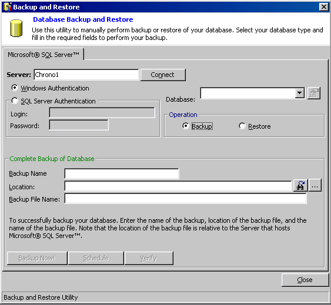



## SQL Backup and Restore

### Description

Easy way to create a backup job and schedule it into SQL Server. Pretty small and restricted but allows you to specify backup schedule such as Daily, Monthly etc. You can backup your database and restore it.
 
### More Info
 

             |
---                |---
**Submitted On**   |2003-04-25 01:02:14
**By**             |[Kamau](https://github.com/Planet-Source-Code/PSCIndex/blob/master/ByAuthor/kamau.md)
**Level**          |Intermediate
**User Rating**    |4.8 (48 globes from 10 users)
**Compatibility**  |VB 6\.0
**Category**       |[Databases/ Data Access/ DAO/ ADO](https://github.com/Planet-Source-Code/PSCIndex/blob/master/ByCategory/databases-data-access-dao-ado__1-6.md)
**World**          |[Visual Basic](https://github.com/Planet-Source-Code/PSCIndex/blob/master/ByWorld/visual-basic.md)
**Archive File**   |[SQL\_Backup1580154272003\.zip](https://github.com/Planet-Source-Code/kamau-sql-backup-and-restore__1-45080/archive/master.zip)

